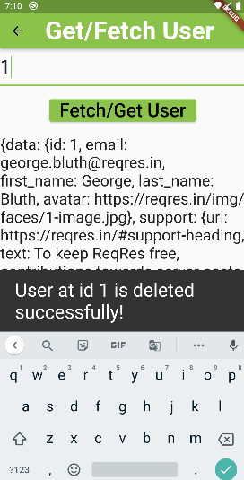

## 1. Research: Flutter Dio Package

- Keywords:
    - dio flutter
    - dio vs http flutter
    - dio interceptors in flutter
    - dio flutter tutorial
    - dio flutter github
    - dio dart
    - dio flutter example
    - dio post request flutter example
    - dio pub dev
    - flutter dio post json
    - flutter dio get request body
    - dio interceptors in flutter example
    - flutter dio post form data
    - dio get request flutter
    - flutter dio best practices
    - flutter dio post json
    - flutter dio post request
    - getx with dio flutter
    - flutter dio example
    - flutter dio get request body
    - dio post
    - dio multipart request flutter
    - dio flutter tutorial
    - flutter dio authorization header
    - dio post request flutter example
    - dio multipart request flutter
- Video Title: Dio Flutter - Dio Tutorial with get, post, put, delete, and multiple requests example


## 2. Research: Competitors

**Flutter Videos/Articles**

- 1.7K: https://www.youtube.com/watch?v=fkK_EMPj1gg
- Playlist: https://www.youtube.com/watch?v=5cKmqkO--oo&list=PL7nW441lfAVI5y-9V5PfsrgpHXRZJdiyl
- 7.9K: https://www.youtube.com/watch?v=U0v0utCEMJ8
- 47K: https://www.youtube.com/watch?v=lvRsi3PjckI
- 23K: https://www.youtube.com/watch?v=JNNjTG4KOVw&t=1s
- 1.4K: https://www.youtube.com/watch?v=7NKCn8fUobk
- 3K: https://www.youtube.com/watch?v=adWGfZOjUqY
- Playlist: https://www.youtube.com/watch?v=Gru7swUQqsg&list=PLldTHNGyIcRvkZ2b5MUeSTCv760b5QGM3
- 10K: https://www.youtube.com/watch?v=UNxxDiHXKAo
- 12K: https://www.youtube.com/watch?v=i-ji06d9C9w
- https://pub.dev/packages/dio
- https://blog.logrocket.com/networking-flutter-using-dio/
- https://dhruvnakum.xyz/networking-in-flutter-dio
- https://medium.com/@ashmikattel/dio-in-flutter-ad6ba26aee36
- https://medium.com/dreamwod-tech/flutter-dio-framework-best-practices-668985fc75b7
- https://dev.to/0xbf/use-dio-in-flutter-dart-307o

**Android/Swift/React Videos**

- NA

**Great Features**
- A powerful HTTP client for Dart/Flutter, which supports global configuration, interceptors, FormData, request cancellation, file uploading/downloading, timeout, and custom adapters etc.
- You can find more at [pub.dev](https://pub.dev/packages/dio) and [blog.logrocket](https://blog.logrocket.com/networking-flutter-using-dio/).

**Problems from Videos**
- Question: Hey there what your opinion about http package in flutter vs dio? <br />
Answer: It really depends, dio is built on top of http package, it provides some extra feature so you don't need to implement it by yourself.
- Question: Why use this json serializable  package if we have extensions to generate the boiler plate? <br />
Answer: Because, this approach is maintainable and better for large projects.

**Problems from Flutter Stackoverflow**

- https://stackoverflow.com/questions/57455741/flutter-handling-error-dio-package-404-400-etc
- https://stackoverflow.com/questions/74070976/cant-catch-error-with-dio-package-in-flutter
- https://stackoverflow.com/questions/73577613/why-i-got-on-error-on-flutter-dio-implementation
- https://stackoverflow.com/questions/74171577/http-status-error-301-in-response-dio-flutter
- https://stackoverflow.com/questions/74150358/how-to-solve-this-dio-library-error-flutter-dart
- https://stackoverflow.com/questions/72558930/network-calling-using-dio-is-not-working-and-returns-error-code-400
- https://stackoverflow.com/questions/73742477/i-get-error-type-dio-not-found-when-using-retrofit-and-dio-together
- https://stackoverflow.com/questions/73493901/flutter-dio-form-data-post-giving-400-error-response-dioerror-dioerrortype-resp

## 3. Video Structure

**Main Points / Purpose Of Lesson**

1. A powerful HTTP client for Dart/Flutter, which supports global configuration, interceptors, FormData, request cancellation, file uploading/downloading, timeout, and custom adapters etc.
2. There are four main types of requests in API calls. For dio, they are following:
    - dio.get() to get the data from the server through API key.
    - dio.post() to get create new data on the server through API key.
    - dio.put() to update the data on the server through API key.
    - dio.delete() to delete the data on the server through API key.
3. These are basic API calls in flutter. We can also request cancellation, file uploading/downloading, timeout, and much more.

**The Structured Main Content**
1. Run `dart pub get dio` to add dio package in your flutter app. Import `import 'package:dio/dio.dart';` where you want to use dio package in your project.
2. There is no need of setup for Android & iOS. We are using [reqres.in](https://reqres.in/) as temporary server in this project.
<br />
<br /> So, base URL will be `https://reqres.in/api` everywhere in this project.
<br />Convert single user JSON data response of `reqres` to dart code from [JSON to Dart](https://javiercbk.github.io/json_to_dart/) and make a  model named UserModel class with `UserModel.dart` file in your project.
3. In `main.dart` file, there are three following `ElevatedButton`s:
   - First `ElevatedButton` is `Get/DeleteUserPage`, it calls `FetchAndDeleteUserPage` from `fetch_and_delete_user_page.dart` file.
<br />It basically implements `_dio.get()` to fetch/get the user data from the `reqres` server through API key and `_dio.delete()` to delete the user data/its id from the `reqres` server through API key.
<br />
<br />Initialize the following:
```dart
final _dio = Dio();
final _baseUrl = 'https://reqres.in/api';
var _userInfo = '';
final _idController = TextEditingController();
bool _isFetching = false;
bool _isDeleting = false;

@override
void dispose() {
  _idController;
  super.dispose();
}
```
It is necessary to `dispose` the `TextEditingController` every time otherwise code may create bugs in app. `_isFetching` and `_isDeleting` is false in the start. They will be changed to `true` with `setState((){});` when user clicks on the button and `CircularProgressIndicator` will be shown while getting/deleting data from the server. After these functions are performed, `ElevatedButton` will be shown.
<br />getUser() method: Complete URL of server is given as `path` parameter in _dio.get() -> `Response response = await _dio.get('$_baseUrl/users/$id');`
```dart
 Future<User?> getUser(String id) async {
    User? user;
    try {
      Response response = await _dio.get('$_baseUrl/users/$id');
      _userInfo = response.data.toString();
      if (kDebugMode) {
        print('User Info: $_userInfo');
      }
      user = User.fromJson(response.data);
    } on DioError catch (e) {
      // The request was made and the server responded with a status code
      // that falls out of the range of 2xx and is also not 304.
      if (e.response != null) {
        if (kDebugMode) {
          print('Dio error!');
          print('STATUS: ${e.response?.statusCode}');
          print('DATA: ${e.response?.data}');
          print('HEADERS: ${e.response?.headers}');
        }
      } else {
        // Error due to setting up or sending the request
        if (kDebugMode) {
          print('Error sending request!');
          print(e.message);
        }
      }
    }
    return user;
  }
```
`Fetch/Get User` button:
```dart
              _isFetching
                  ? const CircularProgressIndicator()
                  : ElevatedButton(
                      onPressed: () async {
                        setState(() {
                          _isFetching = true;
                        });
                        await getUser(_idController.text);
                        setState(() {
                          _isFetching = false;
                          _userInfo;
                        });
                      },
                      child: const Text('Fetch/Get User'),
                    ),
```
When User id is fetched successfully, the API response with data is shown in `Text` form below this button in UI `Text(_userInfo),` and results are also printed in the console.
<br />
`Delete User` button with method: Complete URL of server is given as `path` parameter in _dio.delete() -> `await _dio.delete('$_baseUrl/users/${_idController.text}');`
```dart
              _isDeleting
                  ? const CircularProgressIndicator()
                  : ElevatedButton(
                      onPressed: () async {
                        setState(() {
                          _isDeleting = true;
                        });
                        try {
                          //This shows HTTP 204 No Content success status response code.
                          // It indicates that a request has succeeded, but that the
                          // client doesn't need to navigate away from its current page.
                          await _dio
                              .delete('$_baseUrl/users/${_idController.text}');
                          if (kDebugMode) {
                            print('User deleted! id: ${_idController.text}');
                          }
                        } catch (e) {
                          if (kDebugMode) {
                            print('Error deleting user: ${_idController.text}');
                          }
                        }
                        final snackBar = SnackBar(
                          content: Text(
                            'User at id ${_idController.text} is deleted successfully!',
                            style: const TextStyle(fontSize: 30),
                          ),
                        );
                        if (!mounted) return;
                        ScaffoldMessenger.of(context).showSnackBar(snackBar);
                        setState(() {
                          _isDeleting = false;
                        });
                      },
                      child: const Text('Delete User'),
                    ),
```
When user is deleted successfully, it shows `snackBar` and prints results in console.
<br />
   - Second `ElevatedButton` is `CreateUserPage`, it calls `CreateUserPage` from `create_user_page.dart` file.
<br />It basically implements `_dio.post()` to create a new user with unique id from the `reqres` server through API key.
<br />Initialize the following and always remember to dispose TextEditingController:
```dart
final _dio = Dio();
final _baseUrl = 'https://reqres.in/api';
final _nameController = TextEditingController();
final _jobController = TextEditingController();
bool isCreating = false;
var _userInfo = '';

@override
void dispose() {
  _nameController;
  _jobController;
  super.dispose();
}
```
`_isCreating` is false in the start. It will be changed to `true` with `setState((){});` when user clicks on the button and `CircularProgressIndicator` will be shown while posting(creating new user) data on the server. After this `_dio.post()` method is performed, `ElevatedButton` will be shown.
<br />`Create User` button with method:
```dart
                isCreating
                    ? const CircularProgressIndicator()
                    : ElevatedButton(
                        onPressed: () async {
                          setState(() {
                            isCreating = true;
                          });
                          if (_nameController.text != '' &&
                              _jobController.text != '') {
                            var response = await _dio.post(
                              '$_baseUrl/users',
                              data: {
                                'name': _nameController.text,
                                'job': _jobController.text,
                              },
                              options: Options(
                                headers: {
                                  HttpHeaders.contentTypeHeader:
                                      "application/x-www-form-urlencoded",
                                },
                              ),
                            );
                            _userInfo = response.data.toString();
                            if (kDebugMode) {
                              print(response.statusCode);
                              print(response.data.toString());
                            }
                          }
                          setState(() {
                            isCreating = false;
                            _userInfo;
                          });
                        },
                        child: const Text('Create User'),
                      ),
```
In the end, API response with data is show in `Text` form:
```dart
                Text(_userInfo),
```
<br />
- Third `ElevatedButton` is `UpdateUserPage`, it calls `UpdateUserPage` from `update_user_page.dart` file.
  <br />It basically implements `_dio.put()` to update the details of an existing user with id option on the `reqres` server through API key. You can update all parameters of a user according to server requirements for a user.
  <br />Initialize the following and always remember to dispose TextEditingController:
```dart
final _dio = Dio();
final _baseUrl = 'https://reqres.in/api';
final _nameController = TextEditingController();
final _jobController = TextEditingController();
final _idController = TextEditingController();
bool isUpdating = false;
var _userInfo = '';

@override
void dispose() {
  _nameController;
  _jobController;
  _idController;
  super.dispose();
}

```
`isUpdating` is false in the start. It will be changed to `true` with `setState((){});` when user clicks on the button and `CircularProgressIndicator` will be shown while _dio.put() method updates the data on the server. After this `_dio.put()` method is performed, `ElevatedButton` will be shown.
<br />`Update User` button with method: Here we provide complete URL of server as `path` and `options` as `Options(headers: {HttpHeaders.contentTypeHeader:"application/x-www-form-urlencoded",},),`.
```dart
                isUpdating
                    ? const CircularProgressIndicator()
                    : ElevatedButton(
                        onPressed: () async {
                          setState(() {
                            isUpdating = true;
                          });
                          if (_idController.text != '' &&
                              _nameController.text != '' &&
                              _jobController.text != '') {
                            var response = await _dio.put(
                              '$_baseUrl/users/$_idController',
                              data: {
                                'name': _nameController.text,
                                'job': _jobController.text,
                              },
                              options: Options(
                                headers: {
                                  HttpHeaders.contentTypeHeader:
                                      "application/x-www-form-urlencoded",
                                },
                              ),
                            );
                            _userInfo = response.data.toString();
                            if (kDebugMode) {
                              print(response.statusCode);
                              print(response.data.toString());
                            }
                          }
                          setState(() {
                            isUpdating = false;
                            _userInfo;
                          });
                        },
                        child: const Text('Update User'),
                      ),
```
In the end, API response with data is show in `Text` form:
```dart
                Text(_userInfo),
```
<br />